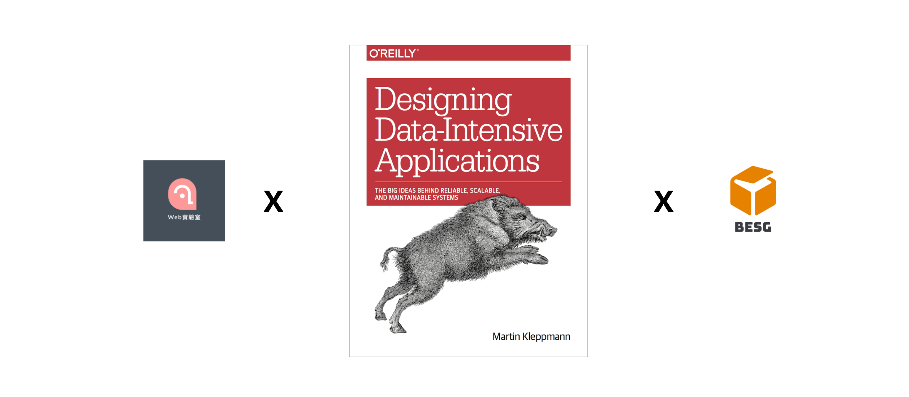

# Weblab x BESG DDIA Study Group


由 [Weblab](https://www.facebook.com/weblab.tw) 與 [BESG](https://github.com/kylemocode/BESG) 兩個社群共同發起的實體讀書會，預計一起閱讀 [DDIA](https://github.com/Vonng/ddia) (Designing Data Intensive Application) 這本經典著作。



## Rules

1. 共分為三期，每期範圍為中文翻譯 Repo 的一個部分
2. 每週一次實體聚會，每次閱讀一章節，一次時間為 2 至 2.5 小時
3. 每期中間隔 2-4 週，每一期結束會舉辦慶功宴或是公開分享會作為結尾。
4. 主持人： KK & Kyle (徵求自願者)

## 行前說明會

時間：2022/4/13 19:15
地點：無心空間
主持人：KK

1. 互相認識
2. 說明進行方式
3. 徵求儲備主持人
4. 作業格式：
   - 學到的要點 \* 3
   - 想問的問題 \* 1
5. 作業繳交方式：Github issues

```
範例格式：
#1 第一章節：學習要點
    reply#1 KK
        * xxxx
        * xxxx
        * xxxx
    reply#2 Kyle
        * xxxx
        * xxxx
        * xxxx

#2 第一章：HA 跟可靠性有關嗎？KK
    reply#1 Kyle
        算吧 !

#3 第一章：可靠性跟可伸縮性有關嗎？Kyle
```

6. 回家作業：第一部份第一章
7. 繳交期限：2022/4/25 09:00（以 github 時間為主）
8. 作業押金：4000 元（每週未繳交作業則扣一千元，用於慶功宴補助）

## 第一期：四月底～五月底

作業繳交期限均為當天早上九點前

### 第一章：可靠性、可伸缩性、可維護性

時間：待訂
主持人：KK
回家作業：第一部份第二章

### 第二章：數據模型與查詢語言

時間：待訂
主持人：老莫
回家作業：第一部份第三章

### 第三章：存儲與檢索

時間：待訂
主持人：待訂
回家作業：第一部份第四章

### 第四章：編碼與演化

時間：待訂
主持人：待訂
回家作業：準備分享會

### 慶功/分享會

時間：六月初 (待訂)
